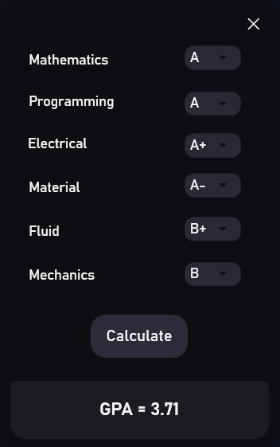

# 🎓 GPA Calculator – Modern GUI Edition

A **simple and modern GPA Calculator** built for **Engineering Students at the University of Moratuwa, Sri Lanka**.  
This tool is designed with a **clean, user-friendly interface** to make GPA calculations faster and easier.

🚀 Unlike older versions (now discontinued), this is the **official and actively maintained version** that will continue to receive improvements.

---

## ✨ Features
- ✅ Modern, easy-to-use **C# based GUI**
- ✅ Currently supports **MPR Student modules** (common intake)
- ✅ Lightweight and fast

## 📸 Screenshots

  

---

## 🔮 Future Plans
We’re just getting started! Here’s what’s coming soon:  
- 📌 Support for more faculties and modules
- 📌 Advanced GPA analytics and insights
- 📌 Exporting GPA reports

---

## 📢 Stay Updated
New features and updates will be added regularly. ⭐ Star this repo to stay tuned!

---

## 🙏 Acknowledgements
Made for students, by students.  
Thank you for checking this out! ❤️
